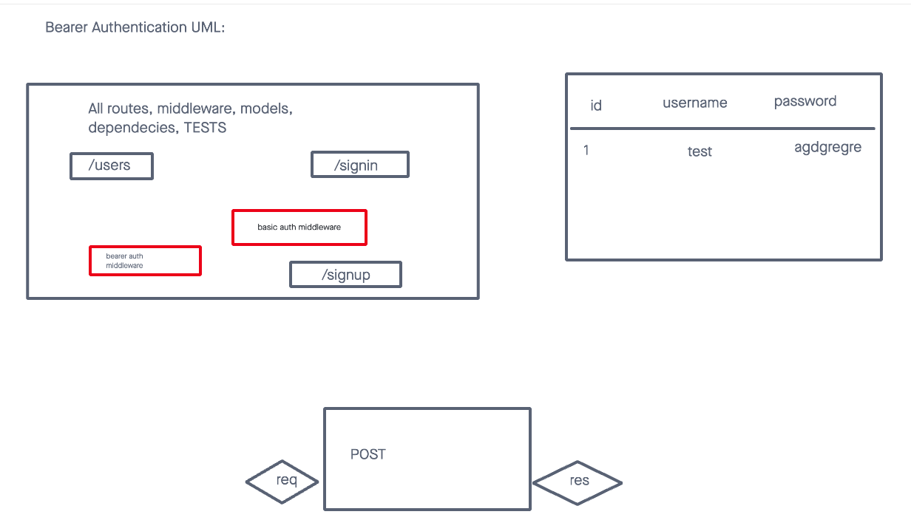

# LAB - Class 07

## Project: Express REST API

### Author: Malik Sadiki-Torres

### Problem Domain

Debug the server and get routes working
### Links and Resources

- [GitHub Actions ci/cd]()
- [back-end server]()

### Collaborators

I followed Ryan Gallaway's demo

### Setup

Install required dependecies and create postgre database

#### `.env` requirements (where applicable)

port variable exists within the env sample

#### How to initialize/run your application (where applicable)

clone repo, `npm i`, then run `nodemon` in the terminal. Then set up your postgres database

#### Routes

- GET : `/users` - specific route to hit
- GET : `/secret`
- POST: `/signin`
- POST: `/signup`

#### Tests

to run tests, after running `npm i`, run the command `npm test`

#### UML

